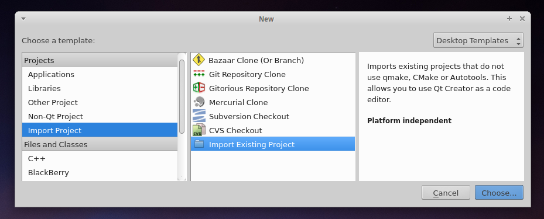

Setting up your build environment
=================================

======
catkin
======

`Catkin <http://wiki.ros.org/catkin>`_ is the recommended dependency manager for use with ROS. Most packages added to the KR github will be intended for use with catkin. Instructions for setting up a catkin workspace are available on the `ROS wiki <http://wiki.ros.org/catkin/Tutorials>`_. Adding a new package to your catkin workspace is `straightforward <http://wiki.ros.org/catkin/Tutorials/CreatingPackage>`_.

Linking packages into your catkin workspace
-------------------------------------------

When managing a large project with multiple packages, it is usually convenient to keep your workspace separate from the git folder. This is achieved by *symbolically linking* your packages into the catkin ``src`` folder.

**Example**

For the following example we suppose the following directory structure exists::

  ~/Documents/catkin  <-- Root of the catkin workspace
  ~/Documents/code    <-- Folder where you store your git repositories

If you wanted to clone the `bluefox2 <https://github.com/KumarRobotics/bluefox2>`_ package and add it to your catkin workspace, you would do the following::

  cd ~/Documents/code
  git clone https://github.com/KumarRobotics/bluefox2
  ln -s bluefox2 ~/Documents/catkin/src/bluefox2

Of course, you do not *have* to link to the root of a git repository. You can link to any folder which is itself a catkin package, or which contains catkin packages.

==========
Qt Creator
==========

`Qt Creator <http://qt-project.org/wiki/category:tools::qtcreator>`_ is a fast, powerful and, cross-platform c++ development IDE. It is actively maintained by the `Digia <http://www.digia.com/>`_ corporation, and is freely available under the LGPL licensing scheme. Qt integrates easily with cmake projects, and offers an elegant GUI development toolkit for Qt - `the recommended platform <http://wiki.ros.org/rqt>`_ for building graphical ROS applications.

Launching Qt Creator
--------------------

In order to access the necessary environment variables (``ROS_PACKAGE_PATH``, ``ROS_MASTER_URI``, etc) Qt Creator must be started from the command line. Alternatively, you can make a desktop launcher by following the instructions `here <http://wiki.ros.org/IDEs#QtCreator>`_.

ROS Packages in Qt Creator
--------------------------

To use Qt Creator with your ROS package. Create a new project with the ``File -> New File or Project`` action. Select the ``Import Project -> Import Existing Project``, as illustrated below:

Assign your project a sensible name, and select the location as the package directory (in which your ``src`` directory resides):

.. image:: /images/qt_step2.png

You will be asked to import files. Select directories which contain headers and source files. When prompted to select project options, you should **NOT** add the IDE files to version control - these are specific to your machine.

.. image:: /images/qt_step3.png

Lastly, you must configure the Qt Creator build settings correctly. Navigate to  the ``Projects`` menu in the mode selector (accessible from ``Window -> Show Mode Selector``).

Append ``build`` to the build directory (you may need to create this directory yourself). Then add a custom build step which performs the operation ``cmake ..`` (.. is the argument). You may also optionally add ``-j4`` to the make arguments in order to parallelize builds. See the image below for an example of valid settings.

.. image:: /images/qt_step4.png

If you wish for Qt Creator to index a set of headers that are not on the default path, add them to your ``.includes`` file in QtCreator. For example::

  include
  build/devel/include

will index your project headers and generated project headers (such as messages).

Better Qt Creator
-----------------

Themes
~~~~~~

Qt creator ships with aweful color schemes. You should change it to increase your productivity. Go get `qtcreator-themes <https://github.com/gareth-cross/qtcreator-themes>`_ for better color schemes.

Beautifier
~~~~~~~~~~

Beautifier is QtCreator plugin that helps you format your code. It supports astyle, clang-format and uncrustify. We recommend using clang-format. To get clang-format, just do::

    sudo apt-get install clang-format-3.5

Go to ``Help`` -> ``About Plugins...``, under ``C++`` click ``Beautifier``. Then restart.

After restart, go to ``Tools`` -> ``Options`` -> ``Beautifier``, and setup your clang-format.
