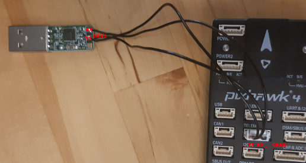

# Pixhawk

Setting up a new Pixhawk for autonomous flight with MAVROS

### Cable (UART to USB)

Tx - Rx

Rx - Tx

Grnd - Grnd



### Linux

##### Create a new udev rule
```
cd /etc/udev/rules.d/
sudo vim 99-pixhawk.rules
```


Add the following line:

`
SUBSYSTEM=="tty", ATTRS{idVendor}=="xxxx", ATTRS{idProduct}=="yyyy", ATTRS{serial}=="zzzz", SYMLINK+="ttyPixhawk", RUN+="/bin/stty -F /dev/ttyPixhawk 921600 raw -echo"
`

You can find your idVendor and idProduct running `lsusb`, identify which one is your device.
The device will be either the pixhawk itself or the UART adapter. **Do this using the interface you will use for autonomy later**. If you're using more than one device with same ids add serial as well.

`
Bus 002 Device 007: ID 26ac:0032
`
In this case `idVendor = 26ac` and `idProduct = 0032`.

`udevadm info -a -n /dev/ttyUSB1 | grep -E '{serial}|{idVendor}|{idProduct}' | head -n 3`

Reboot you computer: `sudo reboot now`

### Pixhawk (QGC)

Connect your Pixhawk to a computer using the micro-usb port and open [QGroundControl](https://docs.qgroundcontrol.com/en/getting_started/download_and_install.html).

Go To *vehicle setup -> params* and set:

- **MAV_1_CONFIG** = TELEM 2 (reboot pixhawk after changing this)
- **MAV_1_MODE** = Onboard
- **SER_TEL2_BAUD** = 921600 

### Test

`roslaunch trefo_launch px4.launch`

### Useful links

http://wiki.ros.org/mavros

[Pixhawk docs for setting up companion computer](https://dev.px4.io/v1.9.0/en/companion_computer/pixhawk_companion.html)
