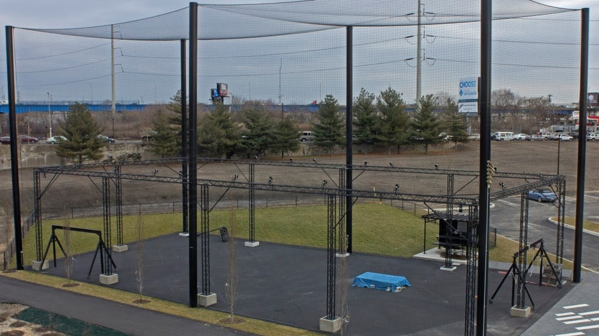

Motion Capture
==============

=====================
Indoor Motion Capture
=====================

The instruction for using indoor Vicon system can be found |vicon_link|.

.. |vicon_link| raw:: html

   <a href="https://docs.google.com/document/d/1QPeEf60QsPUuW3Y5k0TJg2wuvWQ6LtbWxKh4VL5pGTI/edit?usp=sharing" target="_blank">here</a>

======================
Outdoor Motion Capture
======================

This space consists of a 100 ft. L x 50 ft. W x 50 ft. H outdoor netted area instrumented with an all-weather motion capture system comprised of 28 high resolution Qualisys Opus 700+p cameras (http://www.qualisys.com/cameras/oqus/). This space allows testing of aerial and ground vehicles in an outside laboratory setting.

The instruction for using indoor Qualisys system can be found |qualisys_link|.

.. |qualisys_link| raw:: html

   <a href="https://docs.google.com/document/d/12KFOomY3NtuLS0wq8z7SjtWnVX3SOOxZyY20Tqtiwt4/edit?usp=sharing" target="_blank">here</a>

