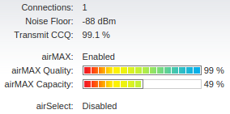

Network Setup
=============

====================
Indoor Network Setup
====================

To ensure your robot has continuous and reliable network connection, you should use ``wpa_supplicant`` if you don't have a display for the robot.

Here are the steps for setting up ``wpa_supplicant``.

0. First of all, ask for a static ip for your robot in the mrsl network.

1. add ``wpa_supplicant.conf`` to ``/etc/wpa_supplicant/``::

    ctrl_interface=/var/run/wpa_supplicant
    ctrl_interface_group=0
    ap_scan=1
    fast_reauth=1

    network={
        ssid="mrsl_airrouterhp"
        scan_ssid=1
        key_mgmt=NONE
    }

2. modify ``/etc/network/interfaces`` so that it looks like::

    auto lo
    iface lo inet loopback

    # auto start wlan0 interface
    auto wlan0
    # use static ip for wlan0
    iface wlan0 inet static
    # your desired ip
    address 192.168.129.xyz
    gateway 192.168.129.1
    netmask 255.255.255.0
    wpa-conf /etc/wpa_supplicant/wpa_supplicant.conf

    auto eth0
    iface eth0 inet static
    address 192.168.1.abc
    netmask 255.255.255.0

3. The next time your power on your robot, it will automatically connect to the router you specified in ``wpa_supplicant.conf``. And if will reconnect even if you lose connection temporarily.

4. A sample ``interfaces`` file can be found `here <https://gist.github.com/versatran01/9f42f24efa36b08f53d6>`_.

=====================
Outdoor Network Setup
=====================

For large-scale outdoor experiments, we need ad reliable long-range wifi connection between the robot and the ground station. To this end, we use `Ubiquiti wireless products <http://www.ubnt.com/products/>`_. Both `bullet M` and `PicoStation M` are good choices.

We recommend using `PicoStation` simply because it is easier to strip the case off.

We use Ubiquiti products mainly for its `airMax <http://dl.ubnt.com/AirMax_ppt.pdf>`_ technology, which is designed for outdoors wireless communication.

Below we describe in detail how to setup *airMax* connection between two *Ubiquiti* devices. We use a *Bullet M* in **Access Point** mode to serve as a ground station and a *PicoStation M* in **Station** mode, which can be seen as a client.

Access Point (Ground Station)
~~~~~~~~~~~~~~~~~~~~~~~~~~~~~

1. On your computer, add a new ``Ethernet`` connection from **Ubuntu Network Manager**.

2. In **IPv4 Settings** tab, change **Method** to ``Manual``

3. Add an **Address**, here we use ``192.168.1.200``, with **Netmask** ``255.255.255.0``. You can leave the **Gateway** and **DNS servers** empty.

4. Power up the *Bullet M* and connect to your computer via Ehternet.

5. Make sure you are on the network configuration you just setup. Then open a browser window with the following **ip address** ``192.168.1.20``, which is the default address for *Bullet M*.

6. The default **Username** and **Password** are both ``ubnt``.

7. In the first tab left to **MAIN**, select ``Enable`` for **airMAX**, then click **Change** and **Apply**. Notice that all the changes you made will be cancelled if you switch tab without applying those changes.

8. In **WIRELESS** tab, make the following changes. The rest can be left as default.

    +---------------+----------------------+
    | Item          | Value                |
    +===============+======================+
    | Wireless Mode | Access Point         |
    +---------------+----------------------+
    | SSID          | ubnt (anyname)       |
    +---------------+----------------------+
    | Channel Width | 20 MHz (recommended) |
    +---------------+----------------------+

9. In **NETWORK** tab, make the following changes.

    +-----------------------+---------------+
    | Item                  | Value         |
    +=======================+===============+
    | Network Mode          | Bridge        |
    +-----------------------+---------------+
    | Management IP address | Static        |
    +-----------------------+---------------+
    | IP Address            | 192.168.1.20  |
    +-----------------------+---------------+
    | Netmask               | 255.255.255.0 |
    +-----------------------+---------------+
    | Gateway IP            | 192.168.1.1   |
    +-----------------------+---------------+

Station (Client)
~~~~~~~~~~~~~~~~

1. On your robot, make sure your ethernet interface (eth0) is on the same subnet as the **Access Point**, which should be ``192.168.1.abc``.

2. Power up the *PicoStation M* and connect to your robot via Ethernet.

3. Open a browser window with the folloing **IP address** ``192.168.1.20`` (default).

4. Again, he default **Username** and **Password** are both ``ubnt``.

5. In **WIRELESS** tab, make the folloing changes. The rest can be left as default.

    +---------------+-------------------+
    | Item          | Value             |
    +===============+===================+
    | Wireless Mode | Station           |
    +---------------+-------------------+
    | SSID          | ubnt (same as AP) |
    +---------------+-------------------+
    | Channel Width | Auto 20/40 MHz    |
    +---------------+-------------------+

6. In **NETWORK** tab, make the following changes. Note that **IP Address** should be something other than ``20`` and ``abc``.

    +-----------------------+---------------+
    | Item                  | Value         |
    +=======================+===============+
    | Network Mode          | Bridge        |
    +-----------------------+---------------+
    | Management IP address | Static        |
    +-----------------------+---------------+
    | IP Address            | 192.168.1.21  |
    +-----------------------+---------------+
    | Netmask               | 255.255.255.0 |
    +-----------------------+---------------+
    | Gateway IP            | 192.168.1.1   |
    +-----------------------+---------------+

7. In **MAIN** tab, remember the **WLAN0 MAC** of this device. Then go back to the **Access Point** setup page on your computer. In **WIRELESS** tab, select ``Enable`` for **MAC ACL** and ``Allow`` for **Policy**. And add the above MAC to the list by clicking on **ACL...**.

Now you should have established **airMAX** connection between the `Bullet M` and the `PicoStation M`. In **MAIN** tab of the **Access Point**, you will see something like this.

===================================
Internet Sharing from Your Computer
===================================

Often, it is convenient to have internet access on your robot.

1. Add the following two lines to your ethernet interface in ``/etc/network/interfaces``::

    gateway 192.168.1.200 # IP address of your laptop
    dns-nameservers 192.168.129.1 8.8.8.8  # for internet access

2. Put the following function in your ``.bashrc``, then you can enable and disable sharing via ``sharenet on/off``::

    function sharenet()
    {
        if [ $# -eq 0 ]; then
            echo "usage: sharenet <on/off>"
            return 0
        fi

        local if_from=wlan0
        local if_to=eth0
        # check command-line commands
        cmd=$1
        case $cmd in
            on )
                sudo su -c "echo 1 > /proc/sys/net/ipv4/ip_forward"
                echo "Enable sharing internet from $if_from to $if_to"
                sudo /sbin/iptables -A FORWARD -i $if_to -o $if_from -j ACCEPT
                sudo /sbin/iptables -A FORWARD -i $if_from -o $if_to -m state --state RELATED,ESTABLISHED -j ACCEPT
                sudo /sbin/iptables -t nat -A POSTROUTING -o $if_from -j MASQUERADE
                ;;
            off )
                sudo su -c "echo 0 > /proc/sys/net/ipv4/ip_forward"
                echo "Disable sharing internet from $if_from to $if_to"
                ;;
            * )
                echo "sharenet: $1: invalid command"
                echo "usage: sharenet <on/off>"
                ;;
        esac
    }
