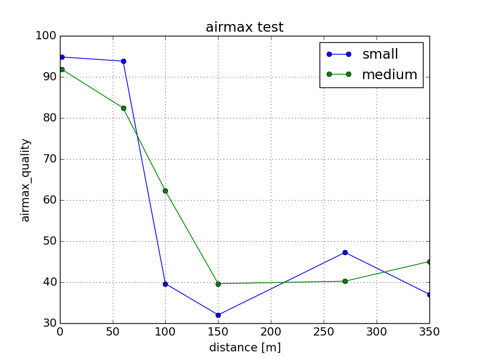

Wifi Test
=========

On 2014-12-17, we conducted a test comparing bullet airmax connection to normal wifi connection. 

==========
Test Setup
==========

The test uses 1 base station, which is a bullet-M2HP with an EnGenius EAG-2408 antenna. There are three clients who connect to the station:

1. Bullet-M2HP with small antenna
2. Bullet-M2HP with medium antenna
3. Intel 7260HMW IEEE 802.11AC, dual-band, 2x2 Wi-Fi

The bullets are connected to the base station via Airmax, while the Intel card is connected to the base station via normal wireless connection. The `Channel Spectrum Width` is set to 40 MHz, which gives a max TX rate of 150 Mbps.

We picked 6 points at Penn Park with various distances to the base station (which is located at point A), and we test the connection at those points with the three configuration mentioned above.

============
Test Results
============

airmax
~~~~~~

The following images show comparision of airmax capacity, quality and signal strength at different distances using two different antenna with airmax enabled.

Note that even though Point D is significantly closer to base station than Point E, it experienced worse connection. That is because D is below A while E is on a bridge and above A.

bandwidth
~~~~~~~~~

The following image shows comparision of bandwidth at different distances using the above configuration and normal wifi.

=======
Summary
=======

It seems like the client's antenna size does not make a huge difference in coneection quality.
If you are doing experiments in open space and within 100 meters, then you can probably get away with normal wireless connection.
If your robot needs to go further away and you want to monitor its status, then you should switch to bullet airmax connection.
If you need good connection even at more than 400 meters away, then you should buy a better bullet.

We will do some more tests in 2015 in Biglervielle and California and will update this report later.
